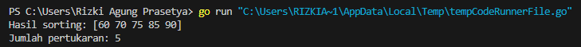
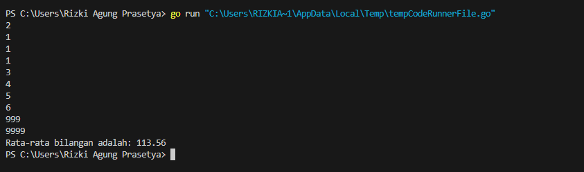
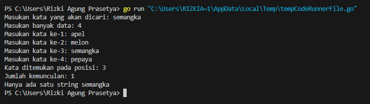
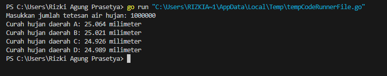
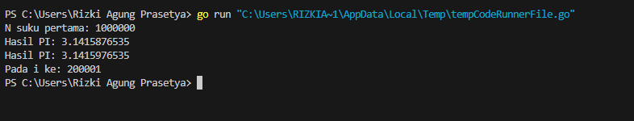

<h1 align="center">Laporan Praktikum Modul 17 <br>Skema Pemrosesan Sekuensial</h1>

<p align="center">RIZKI AGUNG PRASETYA - 103112400263</p>

  

# Dasar Teori

Skema pemrosesan sekuensial merupakan salah satu pola dasar dalam pemrograman algoritma yang digunakan untuk memproses data secara berurutan sesuai urutan masuknya data. Dalam pendekatan ini, data dapat dibaca dan diproses hingga jumlah tertentu (tanpa marker), atau hingga ditemukan penanda khusus (marker) yang menandai akhir data. Konsep ini penting karena memberikan kerangka berpikir sistematis dalam menyusun algoritma yang efisien, termasuk penanganan kondisi seperti data kosong, pemrosesan elemen pertama sebagai kasus khusus, dan pencarian nilai maksimum atau rata-rata dari sekumpulan data. Pendekatan sekuensial ini mencerminkan logika prosedural yang mendasari banyak algoritma dasar dalam ilmu komputer.

  

---

# Guided

  

## Soal 1

> Aldi memiliki daftar nilai ulangan matematika temannya: 75, 60, 90, 85, dan 70. Ia ingin mengurutkan nilai tersebut dari yang terkecil ke yang terbesar menggunakan metode Bubble Sort.

> Pertanyaan:

> 1. Tunjukkan proses pengurutan nilai menggunakan Bubble Sort hingga semua nilai terurut.

> 2. Berapa kali pertukaran (swap) terjadi dalam proses ini?

  

```go

package main

  

import "fmt"

  

func BubbleSort(array []int) ([]int, int) {

    pertukaran := 0

    for i := 0; i < len(array)-1; i++ {

        for j := 0; j < len(array)-i-1; j++ {

            if array[j] > array[j+1] {

                array[j], array[j+1] = array[j+1], array[j]

                pertukaran++

            }

        }

    }

    return array, pertukaran

}

func main() {

    array := []int{75, 60, 90, 85, 70}

    arrayTerurut, pertukaran := BubbleSort(array)

    fmt.Println("Hasil sorting:", arrayTerurut)

    fmt.Println("Jumlah pertukaran:", pertukaran)

  

}

```



### Penjelasan

Program ini dimulai dengan mendefinisikan sebuah array yang berisi angka-angka yang akan diurutkan. Fungsi BubbleSort kemudian dipanggil untuk mengurutkan array dari angka terkecil ke terbesar. Selama proses pengurutan, setiap kali dua elemen bertukar tempat, variabel penghitung pertukaran akan bertambah satu. Setelah seluruh elemen terurut, program mencetak hasil array yang sudah terurut beserta jumlah pertukaran yang terjadi selama proses pengurutan.

  

---

# Unguided

## Soal 1

>Diberikan sejumlah bilangan real yang diakhiri dengan marker 9999, cari rerata dari bilanganbilangan tersebut

  

```go

package main

  

import (

    "fmt"

)

  

func main() {

    var angka float64

    var total float64

    var jumlah int

  

    fmt.Scanln(&angka)

  

    if angka == 9999 {

        fmt.Println("Tidak ada angka yang dimasukan")

    } else {

        total = angka

        jumlah = 1

  

        for {

            fmt.Scanln(&angka)

            if angka == 9999 {

                break

            }

            total += angka

            jumlah++

        }

  

        rataRata := total / float64(jumlah)

        fmt.Printf("Rata-rata bilangan adalah: %.2f\n", rataRata)

    }

}

```



### Penjelasan

Program ini menerima sejumlah bilangan real dari pengguna yang diakhiri dengan marker 9999. Jika angka pertama yang dimasukkan adalah 9999, program akan menampilkan pesan "Tidak ada angka yang dimasukkan". Jika tidak, program akan menjumlahkan semua bilangan yang dimasukkan dan menghitung jumlah angka yang valid. Setelah proses input selesai (ketika 9999 dimasukkan), program menghitung rata-rata dengan membagi total jumlah bilangan dengan jumlah angka yang dimasukkan, lalu menampilkan hasilnya dengan format dua angka desimal.

  

---

## Soal 2

>Diberikan string x dan n buah string. x adalah data pertama yang dibaca, n adalah data bilangan yang dibaca kedua, dan n data berikutnya adalah data string. Buat algoritma untuk menjawab pertanyaan berikut:

>a. Apakah string x ada dalam kumpulan n data string tersebut?

>b. Pada posisi ke berapa string x tersebut ditemukan?

>c. Ada berapakah string x dalam kumpulan n data string tersebut?

>d. Adakah sedikitnya dua string x dalam n data string tersebut?

  

```go

package main

  

import (

    "fmt"

)

  

func cariString(target string, banyak int) {

    var posisi []int

  

    for i := 1; i <= banyak; i++ {

        var input string

        fmt.Print("Masukan kata ke-", i, ": ")

        fmt.Scanln(&input)

        if input == target {

            posisi = append(posisi, i)

        }

    }

  

    if len(posisi) > 0 {

        fmt.Print("Kata ditemukan pada posisi: ")

        for i, p := range posisi {

            if i > 0 {

                fmt.Print(", ")

            }

            fmt.Print(p)

        }

        fmt.Println("\nJumlah kemunculan:", len(posisi))

        if len(posisi) >= 2 {

            fmt.Println("Ada sedikitnya dua kata", target)

        } else {

            fmt.Println("Hanya ada satu string", target)

        }

    } else {

        fmt.Println("Kata tidak ditemukan.")

    }

}

  

func main() {

    var target string

    var banyak int

  

    fmt.Print("Masukan kata yang akan dicari: ")

    fmt.Scanln(&target)

    fmt.Print("Masukan banyak data: ")

    fmt.Scanln(&banyak)

  

    cariString(target, banyak)

}

```



### Penjelasan

Program ini meminta pengguna untuk memasukkan kata yang ingin dicari dan jumlah kata yang akan dimasukkan. Kemudian, program mencari posisi kemunculan kata tersebut di dalam daftar input pengguna. Jika kata ditemukan, program akan menampilkan posisi-posisi kata tersebut serta jumlah kemunculannya. Jika kata ditemukan lebih dari satu kali, program akan menginformasikan bahwa kata tersebut muncul lebih dari sekali; jika hanya satu kali, program menyebutkan bahwa kata hanya ditemukan sekali. Jika kata tidak ditemukan sama sekali, program akan menampilkan pesan bahwa kata tidak ditemukan.

  

---

## Soal 3

> Empat daerah A, B, C, dan D yang berdekatan ingin mengukur curah hujan. Keempat daerah tersebut digambarkan pada bidang berikut:

> Misal curah hujan dihitung berdasarkan banyaknya tetesan air hujan. Setiap tetesan berukuran 0.0001 ml curah hujan. Tetesan air hujan turun secara acak dari titik (0,0) sampai (1,1). Jika diterima input yang menyatakan banyaknya tetesan air hujan. Tentukan curah hujan untuk keempat daerah tersebut.

>

> Buatlah program yang menerima input berupa banyaknya tetesan air hujan. Kemudian buat koordinat/titik (x, y) secara acak dengan menggunakan fungsi rand.Float64(). Hitung dan tampilkan banyaknya tetesan yang jatuh pada daerah A, B, C dan D. Konversikan satu tetesan berukuran 0.0001 milimeter.


```go

package main

  

import (

    "fmt"

    "math/rand"

    "time"

)

  

func inisialisasi() int {

    var jumlahTetesan int

    fmt.Print("Masukkan jumlah tetesan air hujan: ")

    fmt.Scan(&jumlahTetesan)

    return jumlahTetesan

}

  

func tetesHujan(jumlahTetesan int) (int, int, int, int) {

    var daerahA, daerahB, daerahC, daerahD int

    for i := 0; i < jumlahTetesan; i++ {

        x := rand.Float64()

        y := rand.Float64()

  

        if x < 0.5 && y < 0.5 {

            daerahA++

        } else if x >= 0.5 && y < 0.5 {

            daerahB++

        } else if x < 0.5 && y >= 0.5 {

            daerahC++

        } else {

            daerahD++

        }

    }

    return daerahA, daerahB, daerahC, daerahD

}

  

func hitungCurahHujan(daerahA, daerahB, daerahC, daerahD int, ukuranTetesan float64) (float64, float64, float64, float64) {

    curahHujanA := float64(daerahA) * ukuranTetesan

    curahHujanB := float64(daerahB) * ukuranTetesan

    curahHujanC := float64(daerahC) * ukuranTetesan

    curahHujanD := float64(daerahD) * ukuranTetesan

    return curahHujanA, curahHujanB, curahHujanC, curahHujanD

}

  

func tampilkanHasil(curahHujanA, curahHujanB, curahHujanC, curahHujanD float64) {

    fmt.Printf("Curah hujan daerah A: %.3f milimeter\n", curahHujanA)

    fmt.Printf("Curah hujan daerah B: %.3f milimeter\n", curahHujanB)

    fmt.Printf("Curah hujan daerah C: %.3f milimeter\n", curahHujanC)

    fmt.Printf("Curah hujan daerah D: %.3f milimeter\n", curahHujanD)

}

  

func main() {

    rand.Seed(time.Now().UnixNano())

  

    ukuranTetesan := 0.0001

  

    jumlahTetesan := inisialisasi()

    daerahA, daerahB, daerahC, daerahD := tetesHujan(jumlahTetesan)

  

    curahHujanA, curahHujanB, curahHujanC, curahHujanD := hitungCurahHujan(daerahA, daerahB, daerahC, daerahD, ukuranTetesan)

    tampilkanHasil(curahHujanA, curahHujanB, curahHujanC, curahHujanD)

}

```



### Penjelasan

Program ini meminta pengguna untuk memasukkan jumlah tetesan air hujan. Setiap tetesan akan ditempatkan secara acak dalam koordinat (x, y) antara 0 hingga 1. Berdasarkan posisi x dan y, tetesan tersebut akan dikategorikan ke dalam salah satu dari empat daerah (A, B, C, D). Setiap daerah mewakili seperempat bidang 1x1. Setelah semua tetesan dihitung, program mengalikan jumlah tetesan di masing-masing daerah dengan ukuran tetesan untuk menghitung dan menampilkan curah hujan (dalam milimeter) di masing-masing daerah.

  

---

## Soal 4

>Berdasarkan formula Leibniz, nilai π dapat dinyatakan sebagai deret harmonik ganti sebagai berikut:

>

>1 − 1/3 + 1/5 − 1/7 + 1/9 − ⋯ = phi/4

>Suku ke-i dinyatakan sebagai 𝑆𝑖 dan jumlah deret adalah 𝑆. Apabila diketahui suku pertama 𝑆1 = 1, suku kedua 𝑆2 = −1/3 . Temukan rumus untuk suku ke-𝒊 atau 𝑆𝑖 . Berdasarkan rumus tersebut, buatlah program yang menghitung 𝑆 untuk 1000000 suku pertama. Perhatikan contoh sesi interaksi program di bawah ini (teks bergaris bawah adalah input/read):


```go

package main

  

import (

    "fmt"

    "math"

)

  

func pembulatan(x float64) float64 {

    return math.Trunc(x*1e10) / 1e10

}

  

func hitungPI(n int) (float64, float64, int) {

    total, sebelumnya := 0.0, 0.0

  

    for i, tanda := 0, 1.0; i < n; i, tanda = i+1, -tanda {

        total += tanda / float64(2*i+1)

        sekarang := total * 4

  

        if i > 0 && math.Abs(sekarang-sebelumnya) < 0.00001 {

            return pembulatan(sebelumnya), pembulatan(sekarang), i + 1

        }

        sebelumnya = sekarang

    }

    return pembulatan(sebelumnya), pembulatan(sebelumnya), n

}

  

func main() {

    var suku int

    fmt.Print("N suku pertama: ")

    fmt.Scan(&suku)

  

    pi1, pi2, iter := hitungPI(suku)

  

    fmt.Printf("Hasil PI: %.10f\n", pi1)

    fmt.Printf("Hasil PI: %.10f\n", pi2)

    fmt.Printf("Pada i ke: %d\n", iter)

}

```



### Penjelasan

Program ini menghitung nilai pendekatan konstanta π (pi) menggunakan deret Leibniz hingga jumlah suku yang ditentukan pengguna. Setiap iterasi menambahkan atau mengurangi suku ke total, lalu mengalikan hasilnya dengan 4. Program membandingkan dua hasil pendekatan terakhir dan berhenti lebih awal jika selisihnya kurang dari 0.00001. Nilai π kemudian dibulatkan hingga 10 angka di belakang koma dan ditampilkan bersama dengan iterasi keberapa pendekatan tersebut stabil.

  

---

## Soal 5

>Monti bekerja pada sebuah kedai pizza, saking ramainya kedai tersebut membuat Monti tidak ada waktu untuk bersantai. Suatu ketika saat sedang menaburkan topping pada pizza yang diletakkan pada wadah berbentuk persegi, terpikirkan oleh Monti cara menghitung berapa banyak topping yang dia butuhkan, dan cara menghitung nilai 𝝅. Ilustrasi seperti gambar yang diberikan di bawah, topping adalah lingkaran-lingkaran kecil. Ada yang tepat berada di atas pizza, dan ada yang jatuh di dalam kotak tetapi berada di luar pizza.

>

>Apabila luas pizza yang memiliki radius r adalah 𝐿𝑢𝑎𝑠𝑃𝑖𝑧𝑧𝑎 = 𝜋𝑟 2 dan luas wadah pizza yang memiliki panjang sisi 𝑑 = 2𝑟 adalah 𝐿𝑢𝑎𝑠𝑊𝑎𝑑𝑎ℎ = 𝑑2 = 4𝑟 2 , maka diperoleh perbandingan luas kedua bidang tersebut 𝐿𝑢𝑎𝑠𝑃𝑖𝑧𝑧𝑎 𝐿𝑢𝑎𝑠𝑊𝑎𝑑𝑎ℎ = 𝜋𝑟 2 4𝑟 2 = 𝜋 4 Persamaan lingkaran adalah (𝑥 − 𝑥𝑐) 2 + (𝑦 − 𝑦𝑐) 2 = 𝑟 2 dengan titik pusat lingkaran adalah (𝑥𝑐 , 𝑦𝑐). Suatu titik sembarang (𝑥, 𝑦) dikatakan berada di dalam lingkaran apabila memenuhi ketidaksamaan: (𝑥 − 𝑥𝑐) 2 + (𝑦 − 𝑦𝑐) 2 ≤ 𝑟 2 Pada ilustrasi topping berbentuk bulat kecil merah dan biru pada gambar adalah titik-titik (𝑥, 𝑦) acak pada sebuah wadah yang berisi pizza. Dengan jumlah yang sangat banyak dan ditaburkan merata (secara acak), maka kita bisa mengetahui berapa banyak titik/topping yang berada tepat di dalam pizza menggunakan ketidaksamaan di atas. Buatlah program yang menerima input berupa banyaknya topping yang akan ditaburkan, kemudian buat titik acak (𝑥, 𝑦) dari bilangan acak riil pada kisaran nilai 0 hingga 1 sebanyak topping yang diberikan. Hitung dan tampilkan berapa banyak topping yang jatuh tepat di atas pizza. Titik pusat pizza adalah (0.5, 0.5) dan jari-jari pizza adalah 0.5 satuan wadah. Perhatikan contoh sesi interaksi program di bawah ini 
```go

package main

  

import (

    "fmt"

    "math/rand"

    "time"

)

  

func inisialisasi() {

    rand.Seed(time.Now().UnixNano())

}

  

func ambilTopping() int {

    var jumlah int

    fmt.Print("Banyak Topping: ")

    fmt.Scan(&jumlah)

    return jumlah

}

  

func cekDiPizza(x, y, cx, cy, r float64) bool {

    return (x-cx)*(x-cx)+(y-cy)*(y-cy) <= r*r

}

  

func hitungTopping(n int, cx, cy, r float64) int {

    toppingCount := 0

    for i := 0; i < n; i++ {

        x := rand.Float64()

        y := rand.Float64()

  

        if cekDiPizza(x, y, cx, cy, r) {

            toppingCount++

        }

    }

    return toppingCount

}

  

func perkirakanPI(n, count int) float64 {

    return float64(count) / float64(n) * 4

}

  

func main() {

    inisialisasi()

  

    n := ambilTopping()

  

    cx, cy, r := 0.5, 0.5, 0.5

  

    toppingCount := hitungTopping(n, cx, cy, r)

  

    fmt.Printf("Topping pada Pizza: %d\n", toppingCount)

  

    pi := perkirakanPI(n, toppingCount)

    fmt.Printf("PI : %.10f\n", pi)

}

```


### Penjelasan

Program ini memperkirakan nilai π (pi) dengan mensimulasikan peletakan topping pada pizza berbentuk lingkaran. Pengguna diminta untuk memasukkan jumlah topping, kemudian program akan memeriksa apakah topping tersebut jatuh di dalam pizza. Berdasarkan jumlah topping yang jatuh di dalam pizza, program menghitung nilai perkiraan π dan menampilkannya dengan presisi hingga 10 angka di belakang koma.