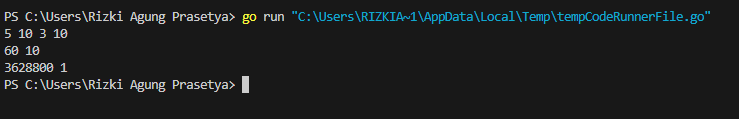
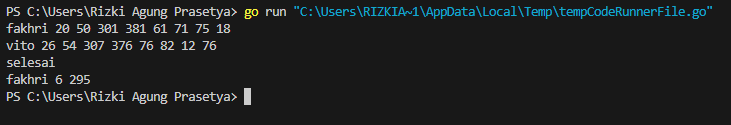
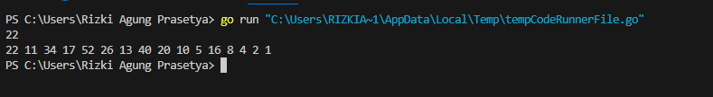

<h1 align="center">Laporan Praktikum Modul 4 <br>Prosedur</h1>

<p align="center">RIZKI AGUNG PRASETYA - 103112400263</p>

  

## Dasar Teori

Prosedur adalah sebuah fungsi yang digunakan untuk menjalankan sekumpulan perintah tanpa mengembalikan nilai. Penggunaan prosedur di bahasa go hampir sama dengan penggunaan fungsi. Yang dimana dibedakan dengan tidak ada tipe data yang digunakan untuk mengembalikan nilai. Namun prosedur juga bisa membaca alamat memori, yaitu disebut dengan Pass by Reference.

  

## Unguided

  

### Soal 1

> Minggu ini, mahasiswa Fakultas Informatika mendapatkan tugas dari mata kuliah matematika diskrit untuk mempelajari kombinasi dan permutasi. Jonas salah seorang mahasiswa, iseng untuk mengimplementasikannya ke dalam suatu program. Oleh karena itu bersediakah kalian membantu Jonas? (tidak tentunya ya :p) Masukan terdiri dari empat buah bilangan asli 𝑎, 𝑏, 𝑐, dan 𝑑 yang dipisahkan oleh spasi, dengan syarat 𝑎 ≥ 𝑐 dan 𝑏 ≥ 𝑑. Keluaran terdiri dari dua baris. Baris pertama adalah hasil permutasi dan kombinasi 𝒂 terhadap 𝑐, sedangkan baris kedua adalah hasil permutasi dan kombinasi 𝑏 terhadap 𝑑. Catatan: permutasi (P) dan kombinasi (C) dari 𝑛 terhadap 𝑟 (𝑛 ≥ 𝑟) dapat dihitung dengan menggunakan persamaan berikut! 𝑃(𝑛, 𝑟) = 𝑛! (𝑛−𝑟)! , sedangkan 𝐶(𝑛, 𝑟) = 𝑛! 𝑟!(𝑛−𝑟)!

  

```go

package main

  

import "fmt"

  

// Proedur untuk menghitung nilai faktorial

func factorial(n int, hasil *int) {

    *hasil = 1

    for i := 1; i <= n; i++ {

        *hasil *= i

    }

}

  

// Proedur untuk menghitung nilai permutasi

func permutation(n, r int, hasil *int) {

    var faktorialN, faktorialNR int

  

    // menggunakan prosedur factorial untuk menghitung faktorial dari n, r maupun n-r

    factorial(n, &faktorialN)

    factorial(n-r, &faktorialNR)

    *hasil = faktorialN / faktorialNR

}

  

// Proedur untuk menghitung nilai kombinasi

func combination(n, r int, hasil *int) {

    var faktorialN, faktorialR, faktorialNR int

  

    // menggunakan prosedur factorial untuk menghitung faktorial dari n, r maupun n-r

    factorial(n, &faktorialN)

    factorial(r, &faktorialR)

    factorial(n-r, &faktorialNR)

    *hasil = faktorialN / (faktorialR * faktorialNR)

}

  

func main() {

    var a, b, c, d, permutationA, permutationB, combinationA, combinationB int

    fmt.Scan(&a, &b, &c, &d)

  

    if a >= c && b >= d {

        permutation(a, c, &permutationA)

        combination(a, c, &combinationA)

        permutation(b, d, &permutationB)

        combination(b, d, &combinationB)

        fmt.Println(permutationA, combinationA)

        fmt.Println(permutationB, combinationB)

    } else {

        fmt.Print("Input tidak valid")

    }

  

}

```



### Penjelasan

Ketika program berjalan, program akan meminta untuk memasukan 4 bilangan asli yang masing-masing disimpan pada variabel a, b, c dan d, dan ada beberapa syarat yang harus dipenuhi, yaitu 𝑎 ≥ 𝑐 dan 𝑏 ≥ 𝑑. Kemudian akan terdapat beberapa proses, yaitu faktorial, permutasi dan kombinasi. Untuk output yang dihasilkan adalah permutasi dan kombinasi a terhadap c, sedangkan baris kedua adalah hasil permutasi dan kombinasi b terhadap d.

  

#### a. Prosedur factorial

```go

// Proedur untuk menghitung nilai faktorial

func factorial(n int, hasil *int) {

    *hasil = 1

    for i := 1; i <= n; i++ {

        *hasil *= i

    }

}

```

Dapat kita ketahui bahwa faktorial akan menghitung perkalian dari 1 hingga ke bilangan n. Yaitu semisal n adalah 5, maka akan dihitung 5x4x3x2x1. Pada prosedur ini, variabel hasil di definisikan dengan nilai 1 karena mencegah hasil menjadi 0. Kemudian perulangan akan berjalan yang dimulai dari angka 1 hingga ke nilai n. Ketika perulangan sampai di nilai n, maka otomatis perulangan akan berhenti. Dan hasil akan menyimpan hasil perkalian angka yang telah muncul pada saat perulangan, yaitu 1 hingga ke n. Polanya yaitu:

```go

1 × 1 = 1

1 × 2 = 2

2 × 3 = 6

6 × 4 = 24

24 × 5 = 120

```

  

#### b. Prosedur Permutation

```go

// Proedur untuk menghitung nilai permutasi

func permutation(n, r int, hasil *int) {

    var faktorialN, faktorialNR int

  

    // menggunakan prosedur factorial untuk menghitung faktorial dari n, r maupun n-r

    factorial(n, &faktorialN)

    factorial(n-r, &faktorialNR)

    *hasil = faktorialN / faktorialNR

}

```

Prosedur ini digunakan untuk menghitung sebuah permutasi, yaitu menggunakan rumus

n!/(n-r)! yaitu kunci utamanya ada di faktorial. Prosedur ini menggunakan prosedur faktorial untuk menghitung masing-masing faktorialnya.

  

#### c. Prosedur combination

```go

// Proedur untuk menghitung nilai kombinasi

func combination(n, r int, hasil *int) {

    var faktorialN, faktorialR, faktorialNR int

  

    // menggunakan prosedur factorial untuk menghitung faktorial dari n, r maupun n-r

    factorial(n, &faktorialN)

    factorial(r, &faktorialR)

    factorial(n-r, &faktorialNR)

    *hasil = faktorialN / (faktorialR * faktorialNR)

}

```

Sama halnya seperti permutasi, prosedur kombinasi memanfaatkan prosedur faktorial, yang dimana rumus dari kombinasi itu sendiri adalah n!/r!(n-r)! yang lagi lagi di dalam rumusnya menggunakan faktorial untuk menentukan hasilnya.

  

### Soal 2

> Kompetisi pemrograman tingkat nasional berlangsung ketat. Setiap peserta diberikan 8 soal yang harus dapat diselesaikan dalam waktu 5 jam saja. Peserta yang berhasil menyelesaikan soal paling banyak dalam waktu paling singkat adalah pemenangnya. Buat program gema yang mencari pemenang dari daftar peserta yang diberikan. Program harus dibuat modular, yaitu dengan membuat prosedur hitungSkor yang mengembalikan total soal dan total skor yang dikerjakan oleh seorang peserta, melalui parameter formal. Pembacaan nama peserta dilakukan di program utama, sedangkan waktu pengerjaan dibaca di dalam prosedur. prosedure hitungSkor(in/out soal, skor : integer) Setiap baris masukan dimulai dengan satu string nama peserta tersebut diikuti dengan adalah 8 integer yang menyatakan berapa lama (dalam menit) peserta tersebut menyelesaikan soal. Jika tidak berhasil atau tidak mengirimkan jawaban maka otomatis dianggap menyelesaikan dalam waktu 5 jam 1 menit (301 menit). Satu baris keluaran berisi nama pemenang, jumlah soal yang diselesaikan, dan nilai yang diperoleh. Nilai adalah total waktu yang dibutuhkan untuk menyelesaikan soal yang berhasil diselesaikan.

  

```go

package main

  

import "fmt"

  

// Prosedur untuk menghitung jumlah soal yang dijawab dan total skor

func hitungSkor(soal, skor *int) {

    var time int

  

    // Mendefinisikan nilai dari soal dan skor awal adalah 0

    *soal = 0

    *skor = 0

  

    // Perulangan yang akan berjalan sebanyak 8 kali

    for i := 0; i < 8; i++ {

        fmt.Scan(&time)

        if time < 301 {

            *soal++

            *skor += time

        }

    }

}

  

func main() {

  

    var nama, pemenang string

    var soal, skor, maksimumSoal, minimumSkor int

  

    maksimumSoal = -1

    minimumSkor = 99999

  

    for {

        fmt.Scan(&nama)

  

        if nama == "Selesai" || nama == "selesai" {

            break

        }

  

        hitungSkor(&soal, &skor)

  

        // Jika jumlah soal sama, pemenang adalah yang memiliki skor lebih kecil (lebih cepat menyelesaikan soal)

        if soal > maksimumSoal || (soal == maksimumSoal && skor < minimumSkor) {

            maksimumSoal = soal

            minimumSkor = skor

            pemenang = nama

        }

    }

  

    fmt.Println(pemenang, maksimumSoal, minimumSkor)

}

```



### Penjelasan

Program ini akan menentukan pemenang dari sebuah kompetisi pemrograman berdasarkan jumlah soal dan waktu pengerjaan. Terdapat perulangan yang berhenti ketika sudah 8 kali perulangan, yaitu sesuai dengan jumlah soal yang dikerjakan masing-masing peserta, yaitu 8 soal. Dan untuk batas pengerjaan masing-masing soal adalah 5 jam, dan di program terangkan bahwa jika lebih dari 300 menit, maka dianggap sudah melebihi batas waktu yang ditentukan.

  

#### a. Prosedur hitungSkor

```go

func hitungSkor(soal, skor *int) {

    var time int

  

    *soal = 0

    *skor = 0

  

    for i := 0; i < 8; i++ {

        fmt.Scan(&time)

        if time < 301 {

            *soal++

            *skor += time

        }

    }

}

```

Prosedur ini digunakan untuk menghitung soal yang berhasil dikerjakan dan total waktu yang berhasil diselesaikan oleh peserta. Prosedur akan melakukan perulangan sebanyak 8 kali untuk menerima inputan waktu pengerjaan soal. Jika waktu yang di input kurang dari 301 detik, maka jumlah soal akan bertambah satu dan total waktu pengerjaan akan diperbarui.

  

#### b. main

```go

func main() {

  

    var nama, pemenang string

    var soal, skor, maksimumSoal, minimumSkor int

  

    maksimumSoal = -1

    minimumSkor = 99999

  

    for {

        fmt.Scan(&nama)

  

        if nama == "Selesai" || nama == "selesai" {

            break

        }

  

        hitungSkor(&soal, &skor)

  

        if soal > maksimumSoal || (soal == maksimumSoal && skor < minimumSkor) {

            maksimumSoal = soal

            minimumSkor = skor

            pemenang = nama

        }

    }

  

    fmt.Println(pemenang, maksimumSoal, minimumSkor)

}

```

Main mengatur jalannya program. Yang dimana ketika program berjalan, program akan terus berjalan hingga dimasukan inputan "Selesai" atau "selesai". Setiap peserta akan menggunakan prosedur dari hitungSkor, untuk menentukan jumlah soal yang dijawab dan total waktu yang diselesaikan. Jika peserta memiliki jumlah soal lebih banyak dari sebelumnya, atau jika jumlahnya sama tetapi waktu pengerjaannya lebih kecil, maka data pemenang diperbarui. Setelah semua peserta diproses, program mencetak nama pemenang, jumlah soal yang dijawab, dan total waktu terbaik.

  

### Soal 3

>Skiena dan Revilla dalam Programming Challenges mendefinisikan sebuah deret bilangan.

Deret dimulai dengan sebuah bilangan bulat n. Jika bilangan n saat itu genap, maka suku

berikutnya adalah ½n, tetapi jika ganjil maka suku berikutnya bernilai 3n+1. Rumus yang sama

digunakan terus menerus untuk mencari suku berikutnya. Deret berakhir ketika suku terakhir

Halaman 9 | M o d u l P r a k t i k u m A l g o r i t m a P e m r o g r a m a n

bernilai 1. Sebagai contoh jika dimulai dengan n=22, maka deret bilangan yang diperoleh

adalah:

22 11 34 17 52 26 13 40 20 10 5 16 8 4 2 1

Untuk suku awal sampai dengan 1000000, diketahui deret selalu mencapai suku dengan nilai 1. Buat program skiena yang akan mencetak setiap suku dari deret yang dijelaskan di atas untuk

nilai suku awal yang diberikan. Pencetakan deret harus dibuat dalam prosedur cetakDeret

yang mempunyai 1 parameter formal, yaitu nilai dari suku awal.

prosedure cetakDeret(in n : integer )

Masukan berupa satu bilangan integer positif yang lebih kecil dari 1000000.

Keluaran terdiri dari satu baris saja. Setiap suku dari deret tersebut dicetak dalam baris yang

dan dipisahkan oleh sebuah spasi.

  

```go

package main

  

import "fmt"

  

// Prosedur untuk mencetak deret dari suatu angka

func cetakDeret(n int) {

    for {

        fmt.Print(n, " ")

        if n == 1 {

            break

        }

  

        if n%2 == 0 {

            n /= 2

        } else {

            n = n*3 + 1

        }

    }

}

  

func main() {

  

    var n int

    fmt.Scan(&n)

  

    if n > 0 && n < 1000 {

        cetakDeret(n)

    }

  

}

```



  

#### Penjelasan

Program ini digunakan untuk mencetak deret angka berdasarkan aturan ketika genap, maka bilangan atau nilai n akan dikali dengan 1/2, jika ganjil dengan 3n + 1. Program diawali dengan membaca sebuah bilangan bulat positif n dari input, dengan batasan 1 hingga 999. Jika input memenuhi syarat, prosedur cetakDeret dipanggil untuk mencetak deretnya. Deret akan dicetak dari nilai n hingga 1.

  

#### a. Prosedur cetakDeret

```go

// Prosedur untuk mencetak deret dari suatu angka

func cetakDeret(n int) {

    for {

        fmt.Print(n, " ")

        if n == 1 {

            break

        }

  

        if n%2 == 0 {

            n /= 2

        } else {

            n = n*3 + 1

        }

    }

}

```

Prosedur cetakDeret(n int) digunakan untuk mencetak deret angka. Prosedur ini menerima satu nilai n, yang merupakan bilangan bulat positif sebagai titik awal deret. Di dalam prosedur, terdapat perulangan for tanpa kondisi yang memastikan perulangan terus berjalan hingga n bernilai 1. Setiap perulangan, nilai n dicetak diikuti oleh spasi. Jika n sudah bernilai 1, perulangan dihentikan dengan perintah break.

  

Selanjutnya, jika n adalah bilangan genap (n % 2 == 0), maka n dibagi 2. Jika n adalah bilangan ganjil, maka n dikalikan 3 lalu ditambah 1 (n = n3 + 1). Proses ini terus berlangsung hingga n mencapai 1.